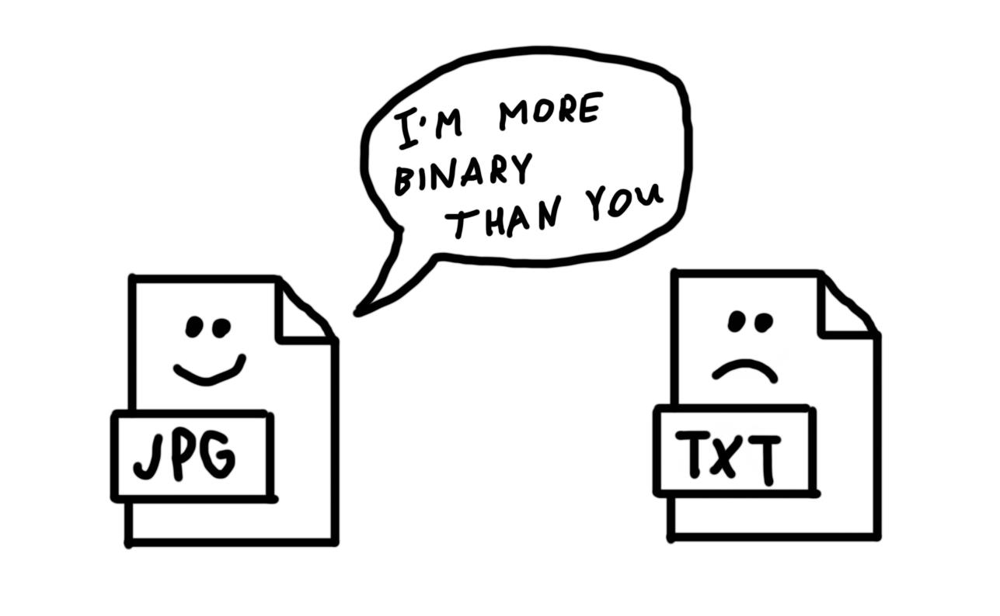

---- Aug 14 16:11:22 +07 2023
# The notion of "binary file" is confusing. You should stop using it

## All files are in the end binary. Expression "binary file" is a kind of tautology similar to saying "digital file". So when you are tempted to say "binary file" (it happens very often actually), stop and think what you really mean.

At first glance it may look like a useless linguistic exercise. But is it really? We talk about "binary files" all the time as if we had some *non-binary* files out there. In fact by saying "binary file" we mean something completely unrelated to binarity, aren't we?

## "Binary" as "non-text"

Most of the time "binary" is used to denote "something other than text". There is a whole body of knowledge in the Internet suggesting that binary data is the opposite of textual data. Currently this idea is plainly expressed in the article "Binary file" on Wikipedia. Even if this distinction between binary and textual is useful in some contexts, for the most part it's simply untrue and misleading.

Somewhere deep inside (at a machine level) all files and all data consist of 0s and 1s. Some bits and bytes can be represented as text and other bits and bytes can be represented as image, etc.

Is there any ground to distinguish binary and text? What makes textual data different from all other kinds of data? Well, text files are quite simple in structure, they are usually just sequences of textual characters and nothing more. Next, their bits and bytes can be displayed as human-readable text unlike other kinds of data. But does it make them less binary than images for example? I don't see how.

So let's make our language a bit clearer and call things by their names. If we are talking about __human-readable and non-human-readable files__, let's use appropriate words for that. "Text files" and "non-text files" will be ok.

## "Binary" as "executable"

Sometimes we talk about __compiling__ a source code into.... binary! Again it makes no sense. We can only compile one binary into another binary. What happens is that we compile a human-readable file to a non-human-readable file (and more efficiently executable by machine). Perhaps most developers understand it instinctively but still why use obscure language?

You may ask, isn't machine code truly more binary than all other stuff? Maybe. Because machine code is "nothing more than binary"; it doesn't represent any "fancier" stuff like images or human-readable text. In case of machine code 0s and 1s are not translated into something else but executed directly by CPU or whatever piece of hardware.

But even if we agree that machine code is "more binary", it still doesn't make all other kinds of data non-binary. The term "machine code" is itself expressive enough and we shouldn't invent any aliases for it.

## But what are __.bin__ files?

From my understanding, bin files are just any files but with a "bin" extension added to them. You can do it with any file and I guess it would be semantically correct. But it won't change a file's binary nature or its behaviour.

